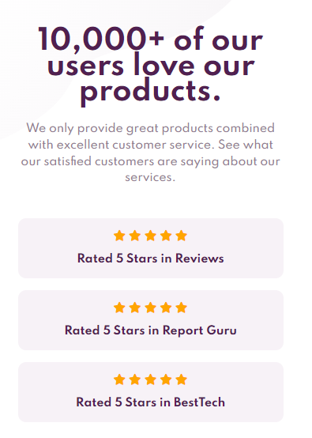
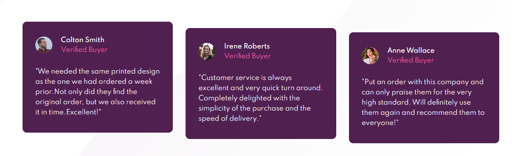
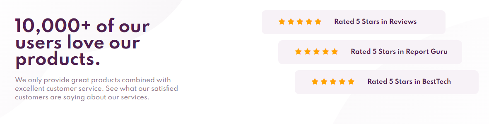

# Frontend Mentor - Social proof section solution

This is a solution to the [Social proof section challenge on Frontend Mentor](https://www.frontendmentor.io/challenges/social-proof-section-6e0qTv_bA). Frontend Mentor challenges help you improve your coding skills by building realistic projects.

## Table of contents

- [The challenge](#the-challenge)
- [Screenshot](#screenshot)
- [Links](#links)
- [Built with](#built-with)
- [What I learned](#what-i-learned)
- [Continued development](#continued-development)
- [Useful resources](#useful-resources)
- [Author](#author)

### The challenge

Users should be able to:

- View the optimal layout for the section depending on their device's screen size

### Screenshot





### Links

- Solution URL: (https://www.frontendmentor.io/solutions/responsive-social-proof-section-built-with-css-grid-and-flexbox-3S9PKIphk)
- Live Site URL: (https://ewenyiwen.github.io/social-proof-section-challenge-hub/)

### Built with

- Semantic HTML5 markup
- CSS custom properties
- Flexbox
- CSS Grid

### What I learned

I have learned how to use CSS child selector to target specific element.

```css
.proud-of-this-css {
 .rating-box:nth-child(1) {
    margin: 0px 80px 0px 0px;
  }
  .rating-box:nth-child(2) {
    margin: 0px 40px 0px 40px;
  }

  .rating-box:nth-child(3) {
    margin: 0px 0px 0px 80px;
  }
```

### Continued development

I would like to focus on understanding more about child selecting properties to properly target the specific element that i would like to make changes

### Useful resources

- [resource 1](https://www.w3schools.com/cssref/sel_nth-child.asp) - This helped me for the trouble to target the elements that i want to . I think this is a very useful tips to apply in the future.

## Author

- Frontend Mentor - [@EwenYiWen](https://www.frontendmentor.io/profile/EwenYiWen)
- GitHub - [EwenYiWen](https://github.com/EwenYiWen)
